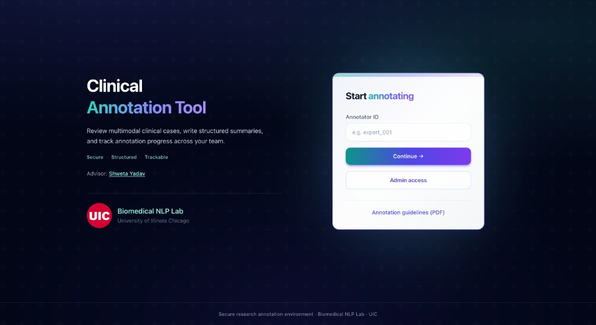
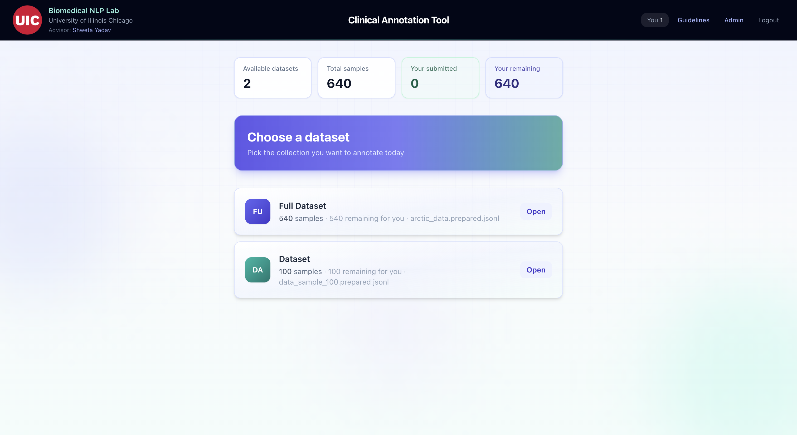
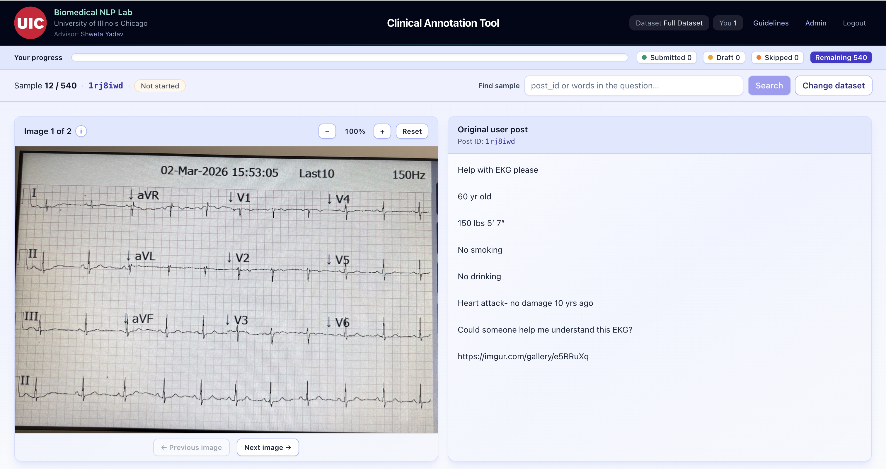
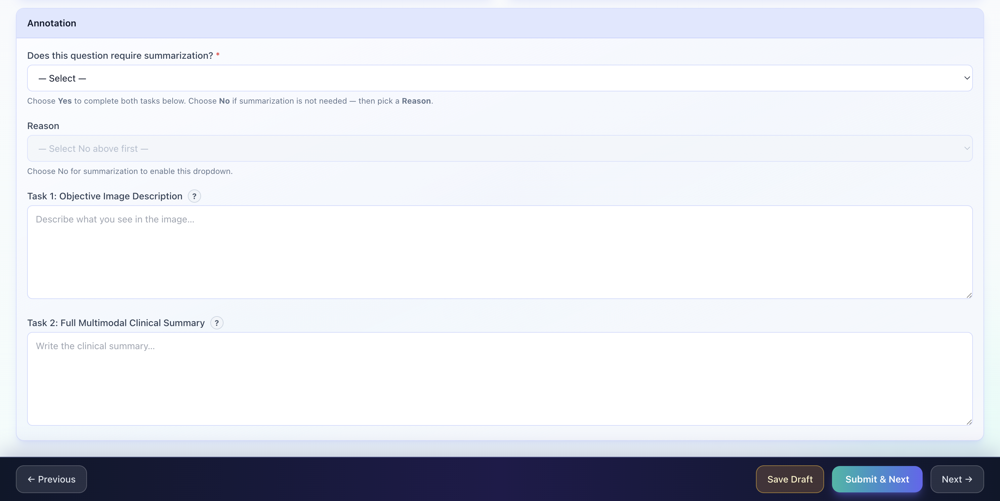
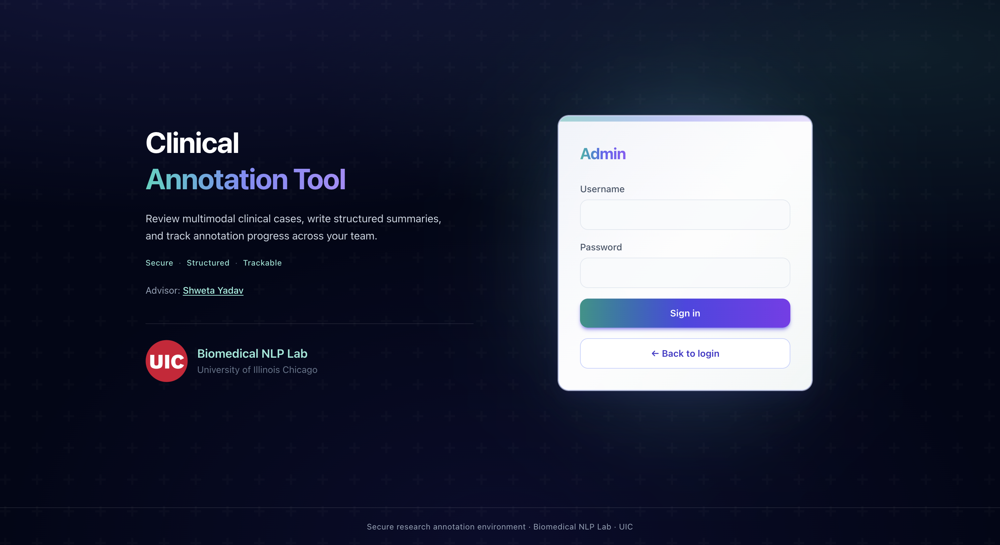
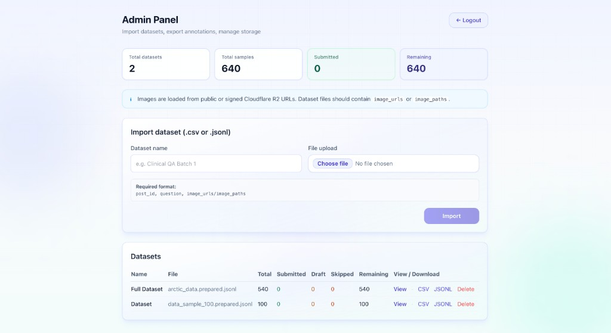

# Clinical Annotation Tool

A lean, **serverless** web app for expert annotation of multimodal clinical
posts (text + images). Built for the **UIC Biomedical NLP Lab** - structured
outputs, a clear annotator workflow, and no backend server to operate.

Each sample can produce two annotation outputs (when summarization is required):

1. **Objective Image Description** - what is literally visible in the image
2. **Final Multimodal Clinical Summary** - clinician-grade synthesis of post + image

> **Live app:** [https://clinical-annotation-tool.abhishek-basu2010.workers.dev](https://clinical-annotation-tool.abhishek-basu2010.workers.dev)  
> **Source:** [github.com/abasu9/clinical-annotation-tool](https://github.com/abasu9/clinical-annotation-tool)

---

## Screenshots

### Annotator login

Two-column landing page with lab branding and a sign-in card for annotator IDs.



### Choose a dataset

Dashboard stats at the top (datasets, samples, your submitted / remaining), then pick a dataset to open.



### Annotation workspace

Progress bar and per-sample status, inline **Find sample** search, then image viewer (left) and original post (right). Multi-image samples use previous/next image controls with zoom.



Summarization gate (Yes / No), optional **Reason**, and Task 1 / Task 2 fields with guideline help. Footer: **Previous**, **Save Draft**, **Submit & Next**, **Next**.



### Admin login

Separate admin gate with username and password.



### Admin panel

Summary cards, Cloudflare R2 guidance, structured import form, and datasets table with progress columns.



---

## Highlights

- **Single-page React app** - Supabase + R2 from the browser; static hosting on Cloudflare Workers.
- **Polished auth UI** - shared login layout, gradient primary actions, UIC branding.
- **Dashboard stats** - summary cards on the dataset picker (per annotator) and admin panel (global).
- **Two roles:**
  - **Annotators** - enter an **annotator ID** (stored in `localStorage`).
  - **Admins** - **username + password** to import datasets, view progress, export, and delete.
- **Annotation layout** - image (left) and original post (right); annotation form below.
- **Sample search** - find samples by `post_id` or question text; toolbar beside **Change dataset**.
- **Summarization gate** - *Does this question require summarization?* (Yes / No); if **No**, a **Reason** is required; if **Yes**, both task fields are required on submit.
- **Status labels** - soft pills (e.g. **Not started**, **Draft**, **Submitted**) on the annotation toolbar and in viewers.
- **In-portal annotation viewer** - filter by status / annotator / search; expand rows; export filtered or full CSV/JSONL.
- **Cloudflare R2** - images load from public or signed R2 URLs in the dataset file (not uploaded through the UI).
- **Dataset prep script** - expand multi-image local folders and rewrite paths to public R2 URLs.
- **Annotation guidelines** - PDF on the login screen and in the header (`public/annotation_guidelines.pdf`).

---

## User roles

| Role | How to access | What they can do |
|------|----------------|------------------|
| **Annotator** | Enter annotator ID on the home screen | View stats, pick a dataset, annotate samples, save draft / submit |
| **Admin** | Click **Admin access** → sign in | View global stats, import CSV/JSONL, browse annotations, export, delete datasets |

**Default admin credentials** (override with env vars before production):

- Username: `nlp`
- Password: `nlp123`

Admin unlock lasts about **8 hours** per browser tab (`sessionStorage`). Use **Logout** in the admin panel to lock again immediately.

Annotators do **not** need a password - only a unique annotator ID (shown on exports).

---

## Architecture

```
 ┌─────────────────────────────────────────────┐
 │  Browser (React + TypeScript + Tailwind)    │
 │                                             │
 │   ┌───────────────┐    ┌──────────────────┐ │
 │   │ Annotator UI  │    │ Admin Panel      │ │
 │   │ (annotator ID)│    │ (username/pw)    │ │
 │   │ Annotate      │    │ Import / Export  │ │
 │   └───────┬───────┘    └────────┬─────────┘ │
 │           │                     │           │
 │           ▼                     ▼           │
 │   ┌─────────────────────────────────────┐   │
 │   │ Supabase JS client (REST)           │   │
 │   └────────────────┬────────────────────┘   │
 └────────────────────┼────────────────────────┘
                      │                     ▲
   ┌──────────────────▼──────────────┐      │ images (HTTPS)
   │ Supabase Postgres               │      │
   │  • datasets / samples /         │      │
   │    annotations (RLS off in       │      │
   │    prototype)                   │      │
   └─────────────────────────────────┘      │
                                            │
                              ┌─────────────┴──────────────┐
                              │ Cloudflare R2               │
                              │  • public image URLs        │
                              └─────────────────────────────┘
```

| Layer            | Choice                                                   |
| ---------------- | -------------------------------------------------------- |
| Frontend         | React 18 + TypeScript + Tailwind CSS (Vite 6)            |
| Database         | Supabase Postgres (browser client)                       |
| Image storage    | Cloudflare R2 (public URLs in dataset file)              |
| Hosting          | Cloudflare Workers static assets (recommended)           |
| Backend          | **None**                                                 |
| Export           | CSV / JSONL from Supabase via the admin UI               |

> **Privacy.** The prototype uses the Supabase **anon key** in the browser with RLS **disabled**. Do not upload identifiable patient data without IRB / project approval. For production, enable RLS and stronger admin auth.

---

## Quick start (local dev)

```bash
git clone https://github.com/abasu9/clinical-annotation-tool.git
cd clinical-annotation-tool
npm install
cp .env.example .env    # add Supabase URL + anon key (admin creds optional)
npm run dev             # http://localhost:5173
```

| Command            | Purpose                                |
| ------------------ | -------------------------------------- |
| `npm run dev`      | Dev server with HMR                    |
| `npm run build`    | Type-check + production `dist/`        |
| `npm run preview`  | Build + local Wrangler preview         |
| `npm run deploy`   | Build + `wrangler deploy` (needs login)|
| `npm run typecheck`| Type-check only                        |

---

## Setup

### 1. Supabase project

1. [supabase.com](https://supabase.com) → **New Project**.
2. **Project Settings → API** → copy **Project URL** and **anon public key**.

### 2. Database schema

In the Supabase **SQL editor**, run [`supabase/schema.sql`](supabase/schema.sql).

Creates `datasets`, `samples`, `annotations` (with `summarization_reason`), indexes, `updated_at` trigger, and **disables RLS** for the prototype.

If your project predates `summarization_reason`, also run
[`supabase/migrations/add_summarization_reason.sql`](supabase/migrations/add_summarization_reason.sql).

### 3. Cloudflare R2 (images)

1. **R2 → Create bucket** (e.g. `clinical-annotation-tool`).
2. **Settings → Public Development URL** - enable it (e.g. `https://pub-xxxxx.r2.dev`). The app loads images in `` tags from this HTTPS URL, not from the S3 API endpoint.
3. Upload image files (see below). The annotation app **does not** upload images - only stores URLs in the JSONL.

Your prepared dataset expects keys like:

`Multimodal images/<post_id>_0.jpg` → public URL  
`https://pub-xxxxx.r2.dev/Multimodal%20images/<post_id>_0.jpg`

#### Upload all images with S3 API compatibility (recommended)

R2 speaks the **S3 API**. Use the **AWS CLI** pointed at R2’s endpoint (not Amazon S3).

**A. Create an R2 API token**

1. Cloudflare dashboard → **R2** → **Manage R2 API Tokens** → **Create API token**.
2. Permission: **Object Read & Write** on your bucket.
3. Save **Access Key ID** and **Secret Access Key** (shown once).
4. Note your **Account ID** on the R2 overview page.

**B. Install AWS CLI** (if needed)

```bash
brew install awscli
aws --version
```

**C. Upload the local folder**

```bash
export R2_ACCOUNT_ID="YOUR_ACCOUNT_ID"
export R2_ACCESS_KEY_ID="YOUR_ACCESS_KEY"
export R2_SECRET_ACCESS_KEY="YOUR_SECRET_KEY"
export R2_BUCKET="clinical-annotation-tool"
export R2_PREFIX="Multimodal images"
export LOCAL_DIR="/path/to/your/images_folder"

chmod +x scripts/upload-images-to-r2.sh
./scripts/upload-images-to-r2.sh
```

Equivalent one-liner:

```bash
aws s3 cp "$LOCAL_DIR" "s3://${R2_BUCKET}/${R2_PREFIX}/" \
  --recursive \
  --endpoint-url "https://${R2_ACCOUNT_ID}.r2.cloudflarestorage.com"
```

**D. Verify**

Open one URL in the browser (must match your public dev URL and prefix):

`https://pub-xxxxx.r2.dev/Multimodal%20images/<post_id>_0.jpg`

If it loads, import your prepared JSONL in Admin.

**Notes**

- S3 endpoint: `https://<ACCOUNT_ID>.r2.cloudflarestorage.com` - for **upload tools only**.
- Public browser URL: `https://pub-….r2.dev/…` - for the **annotation app**.
- Prefix folder name must match what you used in `prepare-dataset.mjs` / prepared JSONL.

### 4. Dataset file format

Required columns:

| Column                          | Notes                        |
| ------------------------------- | ---------------------------- |
| `post_id`                       | Unique per row               |
| `question`                      | Full post text               |
| `image_urls` or `image_paths`   | See formats below            |

`image_urls` may be a single URL, semicolon-separated URLs, a JSON array string, or (JSONL) a native array.

**CSV example:**

```csv
post_id,question,image_urls
DEMO_001,"Synthetic placeholder post","https://pub-xxxx.r2.dev/images_sample_100/DEMO_001_0.jpg"
```

**JSONL example:**

```json
{"post_id":"DEMO_001","question":"Synthetic placeholder post","image_urls":["https://pub-xxxx.r2.dev/images_sample_100/DEMO_001_0.jpg"]}
```

> **XLSX** is not supported - convert to CSV or JSONL first.

### 5. Prepare local data for R2 (optional)

If rows have `local_path` / `local_paths` and your folder has `_0.jpg`, `_1.jpg`, …:

```bash
node scripts/prepare-dataset.mjs \
  --input  "/abs/path/data_sample_100.jsonl" \
  --images "/abs/path/images_sample_100" \
  --base   "https://pub-xxxx.r2.dev/images_sample_100" \
  --output "Dataset/data_sample_100.prepared.jsonl"
```

Import the **prepared** JSONL in Admin - not the raw file with local paths.

Reference file in repo: `Dataset/data_sample_100.prepared.jsonl` (100 rows, one image per post).

**Full dataset (`arctic_data.jsonl`, 540 posts):**

```bash
node scripts/prepare-dataset.mjs \
  --input  "/path/to/arctic_data.jsonl" \
  --images "/path/to/images" \
  --base   "https://pub-xxxx.r2.dev/Multimodal images" \
  --output "Dataset/arctic_data.prepared.jsonl"
```

Uses `title` + `selftext` as `question` when needed. Import `Dataset/arctic_data.prepared.jsonl` in Admin.

### 6. Environment variables

```bash
cp .env.example .env
```

```env
VITE_SUPABASE_URL=https://YOUR-PROJECT.supabase.co
VITE_SUPABASE_ANON_KEY=YOUR_PUBLIC_ANON_KEY

# Optional - defaults to nlp / nlp123 if omitted
VITE_ADMIN_USERNAME=nlp
VITE_ADMIN_PASSWORD=nlp123
```

Restart `npm run dev` after changing `.env`.

Vite inlines `VITE_*` at **build time**. On Cloudflare, set them under **Settings → Build → Variables and Secrets**.

> Admin credentials are compiled into the JS bundle (prototype-only security). Change them before a public launch.

### 7. Deploy

**Cloudflare (recommended)**

1. **Workers & Pages → Connect to Git** → this repo.
2. Build: `npm run build` → output `dist`.
3. Build variables: `VITE_SUPABASE_URL`, `VITE_SUPABASE_ANON_KEY`, and optionally `VITE_ADMIN_USERNAME` / `VITE_ADMIN_PASSWORD`.
4. Push to `main` to redeploy.

**CLI**

```bash
npm run deploy   # requires wrangler login or CLOUDFLARE_API_TOKEN
```

---

## Annotation workflow (annotators)

1. Open the app → enter **annotator ID** → **Continue**.
2. Review dashboard stats → select a **dataset** → **Open**.
3. For each sample:
   - Read the **post** (right) and view **image(s)** (left).
   - Use **Find sample** in the toolbar to jump by `post_id` or question text.
   - **Does this question require summarization?** → **Yes** or **No**.
   - If **No** → choose **Reason** (required for draft and submit).
   - If **Yes** → complete **Task 1** and **Task 2** (guideline help above each field).
4. **Save Draft**, **Submit & Next**, **Previous**, or **Next** (next without saving).

**Submit validation**

| Field | Rule |
| ----- | ---- |
| Requires summarization? | Required (Yes or No) |
| Reason | Required when answer is **No** |
| Task 1 & Task 2 | Required when answer is **Yes**; each must be **at least 20 words** |

---

## Admin workflow

1. **Admin access** → sign in.
2. Review **dashboard stats** (datasets, samples, submitted, remaining).
3. **Import** - dataset name + `.csv` or `.jsonl` (see R2 note and required columns in the UI).
4. **View** - in-portal browser with filters and filtered export.
5. **CSV / JSONL** - full-dataset download per row.
6. **Delete** - remove a dataset and all its samples/annotations.
7. **Logout** - locks admin for this tab.

Exported rows include:

```json
{
  "dataset_id": "…",
  "post_id": "DEMO_001",
  "original_question": "…",
  "image_urls": ["…"],
  "image_status": "Yes",
  "summarization_reason": null,
  "objective_image_description": "…",
  "final_multimodal_clinical_summary": "…",
  "annotator_id": "expert_001",
  "status": "submitted",
  "created_at": "…",
  "updated_at": "…"
}
```

(`image_status` stores Yes/No for “requires summarization”.)

---

## Project layout

```
clinical-annotation-tool/
├─ docs/screenshots/           # README UI images
├─ src/
│  ├─ App.tsx
│  ├─ main.tsx
│  ├─ lib/
│  │   ├─ supabase.ts
│  │   ├─ adminGate.ts
│  │   ├─ data.ts
│  │   ├─ importDataset.ts
│  │   ├─ guidelines.ts
│  │   ├─ ui.ts
│  │   ├─ annotationStatus.ts
│  │   └─ csv.ts / jsonl.ts
│  └─ components/
│      ├─ AnnotatorLogin.tsx
│      ├─ AdminPasswordGate.tsx
│      ├─ AdminPanel.tsx
│      ├─ AuthPageShell.tsx / AuthPageLayout.tsx / AuthPageAside.tsx
│      ├─ AuthFormCard.tsx
│      ├─ AppInteriorShell.tsx
│      ├─ DashboardStatCards.tsx
│      ├─ AnnotationPage.tsx
│      ├─ AnnotationForm.tsx
│      ├─ DatasetSelector.tsx
│      ├─ Header.tsx
│      ├─ SampleSearchBar.tsx
│      └─ …
├─ public/
│  ├─ annotation_guidelines.pdf
│  └─ uic-logo.png
├─ scripts/
│  ├─ prepare-dataset.mjs
│  └─ upload-images-to-r2.sh
├─ supabase/
├─ Dataset/
└─ wrangler.jsonc
```

---

## Data model

```
datasets
  id, name, uploaded_filename, total_samples, created_at

samples
  id, dataset_id → datasets, post_id, question, image_urls (jsonb), created_at

annotations
  id, sample_id → samples, dataset_id, post_id, annotator_id
  image_status              -- "Yes" | "No" (requires summarization)
  summarization_reason      -- set when image_status = "No"
  objective_image_description
  final_multimodal_clinical_summary
  status                    -- draft | submitted | skipped
  created_at, updated_at
  UNIQUE (sample_id, annotator_id)
```

Saves use **upsert** on `(sample_id, annotator_id)`.

---

## Troubleshooting

| Symptom | Fix |
| --- | --- |
| Supabase not configured banner | Set `VITE_SUPABASE_URL` and `VITE_SUPABASE_ANON_KEY` at **build** time; redeploy. |
| Images broken after import | Import **prepared** JSONL with `https://` R2 URLs, not local paths. |
| Admin login fails | Default `nlp` / `nlp123`; or set `VITE_ADMIN_*` in `.env` and restart dev / redeploy. |
| Import: no valid rows | Check `post_id`, `question`, and `image_urls` / `image_paths`. |
| `permission denied for table` | RLS was re-enabled - add policies or disable RLS (see `schema.sql`). |
| Blank page on host | Env vars must be build-time; keep `base: "./"` in Vite config. |

---

## License

[MIT](LICENSE)

## Acknowledgments

**UIC Biomedical NLP Lab** · Supabase · Cloudflare R2 + Workers · Vite · React · Tailwind CSS
